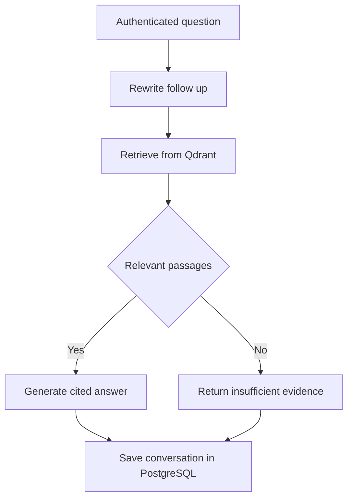

# Nimble RAG Agent

GitHub repository: [firekidu/Agentboilerplate](https://github.com/firekidu/Agentboilerplate). The application and local folder are called `nimble-rag-agent`. To use the documented folder name, clone with:

```bash
git clone https://github.com/firekidu/Agentboilerplate.git nimble-rag-agent
cd nimble-rag-agent
```

A small, teachable **FastAPI + LangGraph + Qdrant** document assistant. Start with a free local demonstration, then use real embeddings and an AI model. Includes an upload/chat workspace, customer isolation, PostgreSQL conversation checkpoints, deployment files and a beginner training manual.

This is an independent implementation informed by [Wassim EL BAKKOURI's template](https://github.com/wassim249/fastapi-langgraph-agent-production-ready-template), not a fork or a feature-complete extension. See [the reference mapping](docs/REFERENCE.md). It is a **commercial pilot starter**, not a claim of audited production readiness.

## Start here

1. Read [the training manual](docs/TRAINING.md), starting with the local lesson.
2. Install current Docker Desktop and Python 3 on your computer. On Windows, use its supported WSL 2 configuration. Commands below use PowerShell on Windows or a terminal on macOS/Linux.
3. Extract or clone this repository. Open a terminal **inside the `nimble-rag-agent` folder**, where `compose.yaml` is located.
4. Generate your private configuration:

```powershell
# Windows
py -3 scripts/setup_env.py
```

```bash
# macOS or Linux
python3 scripts/setup_env.py
```

Save the two printed API keys in your password manager. The application stores their hashes, so it cannot show those keys again. Do not copy terminal output into GitHub issues.

```bash
docker compose up -d --build
docker compose ps
```

Open **http://localhost:8000**, paste the admin key, upload `examples/refund-policy.md`, and ask **What is the refund period?** The answer should contain **30 days** and a source reference. Fake mode uses simple word matching and returns a passage; it is not a language model or a test of semantic retrieval quality.

Stop without deleting data:

```bash
docker compose stop
```

## Switch to live AI

Edit `.env` in a text editor, set `AI_BACKEND=openai`, and fill in `OPENAI_API_KEY` from your API account. Defaults are `gpt-4.1-mini` and `text-embedding-3-small`. Availability depends on your provider account. Live calls incur provider charges.

```bash
docker compose up -d --force-recreate api
```

**Upload your documents again.** Fake vectors and real embeddings use different Qdrant collections. Changing the embedding model, dimensions or chunking configuration also creates a separate collection. Old collections are retained until explicitly retired; see [operations](docs/OPERATIONS.md).

## What is included

- TXT, Markdown and text PDF ingestion, with file, page, text and chunk limits.
- Deterministic document IDs, duplicate detection and retryable failed ingestion.
- Qdrant similarity search filtered by authenticated tenant and ready documents.
- LangGraph question rewriting, retrieval, answer generation, abstention and conversation memory.
- Citation IDs checked against retrieved passages; PDF page references where available.
- Hashed customer API keys, admin/reader roles and PostgreSQL request quotas.
- PostgreSQL checkpoints, deletion and a retention command.
- A browser workspace, `/docs`, health checks, JSON logs and protected Prometheus metrics.
- Docker Compose, Caddy HTTPS, VPS/AWS instructions, backup/restore helpers and GitHub CI.

## How it works



The production graph is a bounded RAG workflow. It has no autonomous write tools. `examples/tool_agent.py` teaches a separate, model-selected read-only tool loop after you understand the RAG project.

## Documents

| Guide | Use it for |
|---|---|
| [Training](docs/TRAINING.md) | Concepts, code tour, exercises and progression |
| [VPS deployment](docs/VPS.md) | Ubuntu, Docker, DNS, HTTPS and verification |
| [AWS deployment](docs/AWS.md) | EC2 launch and a later managed-services roadmap |
| [Operations](docs/OPERATIONS.md) | Backups, restoration, retention, updates and incidents |
| [Commercial pilot](docs/COMMERCIAL.md) | Pricing, customer onboarding and launch criteria |
| [Reference mapping](docs/REFERENCE.md) | What changed from the reference architecture |
| [Verification](docs/VERIFICATION.md) | Tests run and limits of the evidence |

## Develop and test

Install [uv](https://docs.astral.sh/uv/getting-started/installation/), then:

```bash
uv sync --frozen
uv run python examples/lesson_graph.py
uv run ruff check .
uv run pytest -q
```

The default tests use a real Qdrant embedded client, deterministic fake AI and an in-memory metadata store. The PostgreSQL restart test needs a **disposable** `TEST_DATABASE_URL`; CI supplies it. Do not point tests at customer databases. A real Qdrant REST server can additionally be tested with `TEST_QDRANT_URL` and the documented test key in `tests/conftest.py`.

## Boundaries before selling

One operation runs at a time per customer; competing requests receive 409. Uploads are synchronous and restricted to trusted administrators. There is no user signup, billing, per-user document ACL, OCR, reranker, background queue, high availability or full audit trail. A valid citation is not proof that an answer is correct. Do the [commercial pilot checks](docs/COMMERCIAL.md) using real model calls before using customer data.

MIT licensed. The upstream attribution is preserved in `LICENSE.reference`. Dependencies and provider services have their own terms.
