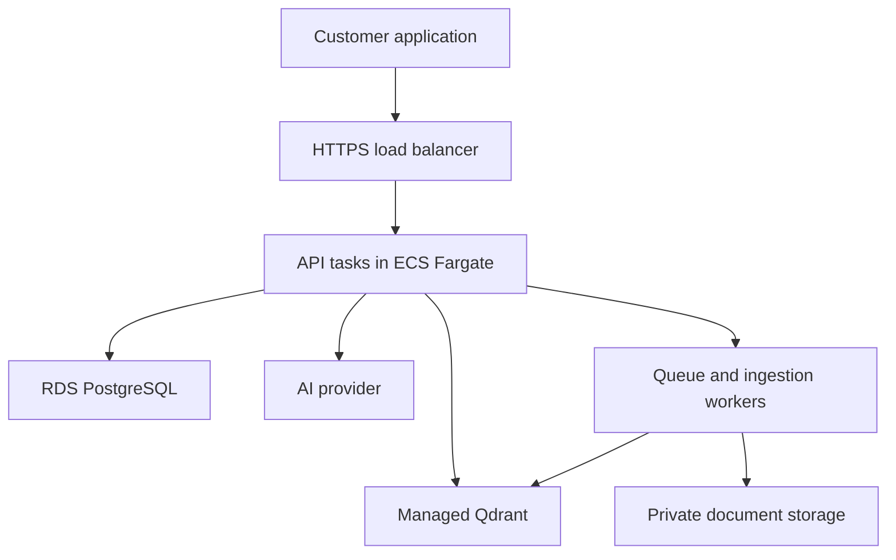

# Deploy on AWS

For the first AWS lesson, use one EC2 instance running the same Docker stack as the VPS. EC2 is AWS's virtual server service. This path teaches AWS networking and billing without introducing several deployment systems at once. It is a single-server pilot and has the same single point of failure as a VPS.

## Understand the AWS names

| AWS term | Meaning in this project |
|---|---|
| Region | Geographic area where you create resources, for example London |
| VPC | Your isolated network in AWS |
| Subnet | A section of that network in an availability zone |
| Internet gateway | Connects a public subnet to the internet |
| Security group | Firewall rules attached to the EC2 network interface |
| EC2 instance | The Linux server that runs Docker |
| EBS volume | The server's persistent disk |
| Elastic IP | A stable public IPv4 address you can associate with the server |
| IAM role | Permissions a service can use without storing a long-lived access key |
| S3 | Object storage suitable for encrypted off-server backup copies |
| CloudWatch | AWS logs, metrics and alarms |

## Create the account controls first

Enable MFA on the root account and use an appropriate administrative identity for normal work. Configure AWS Budgets alerts before launching resources. Budget alerts notify you; do not treat them as a guaranteed hard spending cap. Choose one region and keep the application resources there while learning.

Use the AWS Pricing Calculator for that region and current prices. Include EC2 hours, EBS capacity and snapshots, public IPv4/Elastic IP charges, data transfer and backups. The AI provider is billed separately. Do not assume a free-tier offer covers this deployment or its ongoing storage.

## Launch EC2 in the console

1. Open EC2 in the selected region and choose Launch instance. Name it `nimble-rag-pilot`.
2. Choose an official Canonical Ubuntu Server 24.04 LTS image, x86_64 architecture. Avoid unverified marketplace images.
3. A starting planning choice is a 4 vCPU and 8 GB RAM instance, such as an available matching instance family in your region. Compare burstable and fixed-performance pricing. For burstable instances, check CPU credit charges and sustained load. This repository has no measured users-per-instance rating.
4. Create or select an SSH key pair. Keep the private `.pem` file in a secure location on your computer, outside the repository.
5. For a first lesson, use the default VPC if it exists, and select a public subnet with a route through an internet gateway. Enable a public IPv4 address. If the account has no default VPC, create a VPC and public subnet using the console wizard, or get help from someone who manages that account's network. Do not modify a company's shared VPC casually.
6. Create a security group: TCP 22 from your own public IP with `/32`; TCP 80 and 443 from `0.0.0.0/0`. Add IPv6 web rules only if you deliberately configure IPv6. No inbound rules for databases or port 8000.
7. Configure at least 60 GB gp3 EBS for the starting exercise and enable encryption. Increase storage according to document and backup volume. Decide explicitly whether the disk should be deleted when the instance is terminated.
8. In advanced settings, require IMDSv2 for instance metadata. Do not put `.env`, model keys or GitHub tokens in user-data scripts. No IAM role is needed merely to call an external AI API; add narrowly scoped roles only for AWS actions you actually use.
9. Launch the instance and wait for EC2 status checks to pass. Associate an Elastic IP if you need a stable address for DNS. A normal auto-assigned public IP can change after stopping and starting the instance.

These are configuration choices for a new pilot. Account policies may require a private subnet, VPN, Session Manager or centrally managed roles; follow those policies instead of weakening them.

## Connect and install

From a local terminal:

```bash
ssh -i /path/to/your-key.pem ubuntu@YOUR_ELASTIC_IP
```

On macOS/Linux, `chmod 600 /path/to/your-key.pem` limits access to the key. On Windows, keep the file in your user profile and restrict its permissions through Windows Security if SSH reports that it is accessible to other users.

Upload the archive from your own computer:

```bash
scp -i /path/to/your-key.pem nimble-rag-agent.zip ubuntu@YOUR_ELASTIC_IP:~/
```

On the instance:

```bash
sudo apt-get update
sudo apt-get install -y unzip python3 git
unzip nimble-rag-agent.zip
cd nimble-rag-agent
sudo bash deploy/install_docker_ubuntu.sh
python3 scripts/setup_env.py
```

Then follow the VPS guide from “Generate configuration and start the local demonstration,” skipping its repeated setup command because `.env` already exists. The same steps configure live AI, DNS and Caddy HTTPS. Route 53 is optional; you can keep DNS at your existing provider.

## Operate and control cost

Use EC2 status-check and CPU alarms. EC2 does not report application memory and disk usage by default; install and configure the CloudWatch Agent or another host monitoring agent for those values. Monitor `/health/ready` externally and perform a small scheduled authenticated test question as a separate application check.

Put encrypted backups in a private S3 bucket with Block Public Access enabled. Grant the instance role access only to the required backup prefix. Use an approved AWS CLI or backup tool with that role, never account root keys. Schedule retention and test that the files can be restored. For example, after installing/configuring AWS CLI and the role:

```bash
aws s3 cp backups/20260924T120000Z s3://YOUR_PRIVATE_BUCKET/nimble/20260924T120000Z/ --recursive --sse AES256
```

Replace the example date with your actual completed backup directory. If your organisation requires KMS, configure that key and the corresponding permissions instead. Copying to S3 is an additional step; the supplied backup script does not provision AWS resources or upload to S3 automatically.

Stopping EC2 stops compute usage for that instance but EBS, snapshots and some networking resources can continue to cost money. Terminating a disposable learning environment requires checking attached volumes, snapshots, Elastic IPs, load balancers and any other created resources. Keep the verified backup before deleting a server that holds real data.

## Grow into managed services later

The following is a roadmap, not an implemented second deployment:



ECS Fargate runs API containers without you administering the host OS. Store images in ECR. Place RDS in private subnets and require verified TLS connections. Use Qdrant Cloud or a separately managed Qdrant deployment with appropriate access controls, backups and region. Store secrets in Secrets Manager. Send operational logs to CloudWatch and keep content tracing opt-in.

This move also needs code work: asynchronous ingestion jobs, durable job state, object storage, graceful draining, real schema migrations and a concurrency design beyond the current per-customer lock. Keep Qdrant and PostgreSQL data off ephemeral task storage. A load balancer and two API tasks do not make a single Qdrant node highly available. Plan and test each dependency's recovery separately.

Use this architecture when customer availability needs, operational load or measured traffic justify the extra cost and complexity. Do not start with Kubernetes just to host the learning project.
